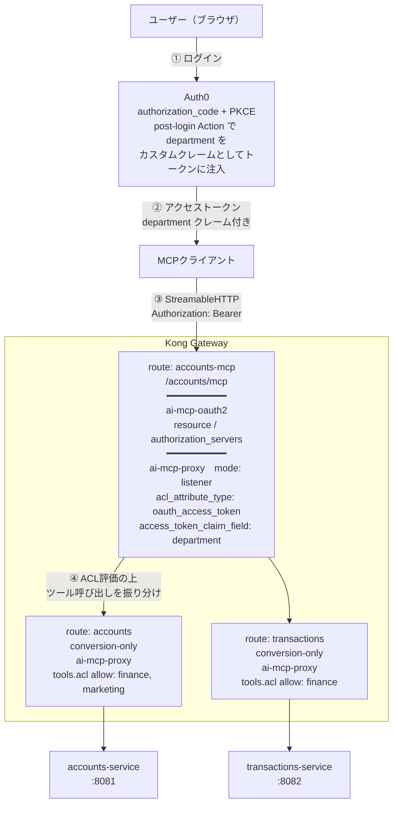

# MCP ACL with OIDC - department属性によるアクセス制御

[Transactions](/transactions.md)で構築したAccount/Transactionの2サービスに対し、OIDC認証後のユーザーが持つ`department`属性の値によってMCP Toolへのアクセスを制御する例。1ユーザー（`department: finance`）は両方のサービスのToolにアクセス可能、もう1ユーザー（`department: marketing`）はAccountサービスのToolのみアクセス可能とする。

## IdPの選定について
当初はIdPとして**Kong Identity**（Konnectネイティブの認可サーバー機能）を検討したが、調査の結果以下の制約が判明したため採用を見送った。

- Kong Identity のAuth Serverは現行の公開仕様上 `client_credentials` / `implicit` グラントが中心で、`authorization_code`によるブラウザ経由の対話的ユーザーログインの公式実例が見当たらない
- Principal（人間ユーザーを含む属性ストア）のmetadataは`basic-auth`/`key-auth`プラグイン経由で使う設計であり、`ai-mcp-oauth2`のクレーム経由のACLパイプラインに接続するdocumentedな経路が見当たらない

このため、本シナリオでは要件（SaaS提供・無料枠・Terraformによる宣言的管理）を満たす**Auth0**を外部IdPとして採用する。

## アーキテクチャ
既存の`transactions.md`と同様、1つの`listener`ルート（`/accounts/mcp`）に2つの`conversion-only`ルート（`accounts`, `transactions`）がタグで紐づく構成をベースにする。

この構成では、Kong標準の`acl`プラグインを`conversion-only`ルートに付けても効かない（`listener`が内部でツール呼び出しを振り分ける際、`conversion-only`ルート側の通常のプラグインチェーンは再実行されないため）。代わりに`ai-mcp-proxy`プラグイン自身が持つネイティブACL機能を利用する。認証には`ai-mcp-oauth2`プラグイン（MCP用OAuth2保護リソース機能、Tech Preview）を`listener`ルートに追加し、Auth0を発行者とするアクセストークンを検証する。



| department | Account Tool | Transaction Tool |
|---|---|---|
| `finance` | ✅ | ✅ |
| `marketing` | ✅ | ❌ (403) |

> [!IMPORTANT]
> ACLは各ツールの`tools[].acl`として定義する必要がある（`default_acl`ではない）。`listener`モードでツール一覧を集約する際、`conversion-only`プラグイン側の`default_acl`は参照されず、`tools[].acl`のみが引き継がれる仕様のため。`default_acl`を`conversion-only`側に書くとACLが一切効かず全て許可されてしまうので注意。
>
> なお`acl_attribute_type`と`access_token_claim_field`は逆に`listener`側にのみ設定する（`conversion-only`側に書くとKongがスキーマ違反として拒否する）。

## ファイル構成
```
kong-mcp-testbed/
├── terraform/
│   ├── main.tf                     # Auth0 provider設定
│   ├── variables.tf                # 入力変数
│   ├── auth0_api.tf                # Resource Server(API)定義。identifier = MCPのresource値
│   ├── auth0_client.tf             # MCPクライアント用OAuthクライアント(SPA, PKCE)
│   ├── auth0_users.tf              # 2ユーザー分の auth0_user (user_metadata.department)
│   ├── auth0_action.tf             # post-loginアクションでdepartmentをカスタムクレーム化
│   ├── outputs.tf                  # issuer, client_id等decK/クライアントに渡す値
│   └── terraform.tfvars.example    # 設定例(コピーしてterraform.tfvarsを作成)
├── conversion-transactions-oidc-acl.yaml   # 既存 conversion-transactions-mcp.yaml をベースに
│                                            # ai-mcp-oauth2 / ai-mcp-proxy ACL設定を追加した新規yaml
└── mcp-acl-with-oidc.md
```
既存の`conversion-transactions-mcp.yaml`は変更せず、新規yamlとして追加している（既存シナリオへの影響を避けるため）。

## 事前準備 - Auth0テナント作成
1. [Auth0](https://auth0.com/)で無料アカウント・テナントを作成する（例: `dev-xxxxxxx.us.auth0.com`）。
2. Terraform実行用のM2Mアプリケーションを手動作成する（Terraformが自分自身の認証情報をAuth0上に作ることはできないため、これだけは手動が必要）。
   - Auth0ダッシュボード > **Applications > APIs > Auth0 Management API > Machine to Machine Applications** タブから新規M2Mアプリケーションを作成、もしくは **Applications > Create Application > Machine to Machine** を選択し、認可対象APIとして`Auth0 Management API`を指定。
   - 付与するスコープ（最低限）:
     ```
     read:clients create:clients update:clients delete:clients
     read:resource_servers create:resource_servers update:resource_servers delete:resource_servers
     read:users create:users update:users delete:users
     read:actions create:actions update:actions delete:actions
     ```
     ※`triggers`という独立したスコープは存在しない。post-loginへのAction紐付け(`auth0_trigger_actions`)もActions APIのエンドポイントを利用するため、`read:actions`/`update:actions`でカバーされる。
   - 作成後に発行される`Domain` / `Client ID` / `Client Secret`を控える。

## Step 1 - Terraformによる認証基盤の構築
[terraform/](/terraform/)ディレクトリに定義。
```bash
cd terraform
cp terraform.tfvars.example terraform.tfvars
# terraform.tfvars を編集し、事前準備で控えた Domain / Client ID / Client Secret 等を設定
terraform init
terraform apply
```
適用されるリソース:
- `auth0_resource_server.mcp_api` - MCPのresource識別子(`http://localhost:8000/accounts/mcp`)をidentifierに持つAPI
- `auth0_client.mcp_inspector` - MCPクライアント用のOAuthクライアント（SPA、`authorization_code` + PKCE）
- `auth0_user.test_user["finance_user"]` / `["marketing_user"]` - `user_metadata.department`にそれぞれ`finance`/`marketing`を設定した2ユーザー
- `auth0_action.add_department_claim` + `auth0_trigger_actions.post_login_flow` - post-login時に`user_metadata.department`を、ネームスペース付きカスタムクレーム（`https://kong-mcp-testbed.example/department`）としてID/アクセストークン双方に注入するAction

> [!NOTE]
> `test_user_password`はAuth0のパスワード強度チェックを通る必要がある。辞書に載っている単語を含む値や全角文字が混じった値は`PasswordStrengthError: Password is too weak`で弾かれるため、ランダム性のある半角英数記号を使うこと。

`terraform apply`完了後、以下のoutputを確認する。
```bash
terraform output
```
- `auth0_issuer` → 次のStepで`DECK_AUTH0_ISSUER`として使用
- `mcp_inspector_client_id` → MCPクライアントのOAuth設定で使用
- `test_user_emails` → ログイン確認用

## Step 2 - Kongゲートウェイ定義の適用
[conversion-transactions-oidc-acl.yaml](/conversion-transactions-oidc-acl.yaml)に定義。Auth0のissuer URLを環境変数で渡してdecK syncを実行する。
```bash
export DECK_AUTH0_ISSUER=$(terraform -chdir=terraform output -raw auth0_issuer)
deck gateway sync conversion-transactions-oidc-acl.yaml
```
主要な差分は以下の3点（[transactions.md](/transactions.md) Step 2の構成に対して）。

1. `listener`ルート（`accounts-mcp`）に`ai-mcp-oauth2`プラグインを追加し、Auth0を認可サーバーとして登録:
   ```yaml
   - name: ai-mcp-oauth2
     route: accounts-mcp
     config:
       resource: http://localhost:8000/accounts/mcp
       authorization_servers:
       - "${{ env "DECK_AUTH0_ISSUER" }}"
   ```
2. `listener`モードの`ai-mcp-proxy`に、ACL判定の主体をアクセストークンのカスタムクレームから取得する設定を追加:
   ```yaml
   config:
     acl_attribute_type: oauth_access_token
     access_token_claim_field: '.["https://kong-mcp-testbed.example/department"]'
   ```
3. 各`conversion-only`の`ai-mcp-proxy`で、ツールごとに`acl`を定義:
   ```yaml
   # accounts route の各ツール
   tools:
   - acl:
       allow: [finance, marketing]
     annotations:
       title: Create an account
     ...
   # transactions route の各ツール
   tools:
   - acl:
       allow: [finance]
     annotations:
       title: Create a transaction
     ...
   ```

適用後、Kongが公開する保護リソースメタデータを確認できる。
```bash
curl -s http://localhost:8000/accounts/mcp/.well-known/oauth-protected-resource
# {"resource":"http://localhost:8000/accounts/mcp","authorization_servers":["https://dev-xxxxxxx.us.auth0.com/"]}
```
未認証のリクエストは401とOAuthチャレンジヘッダで拒否される。
```bash
curl -i -X POST http://localhost:8000/accounts/mcp -H "Content-Type: application/json" \
  -d '{"jsonrpc":"2.0","id":1,"method":"tools/list"}'
# HTTP/1.1 401 Unauthorized
# WWW-Authenticate: Bearer resource_metadata="http://localhost:8000/accounts/mcp/.well-known/oauth-protected-resource"
```

## Step 3 - 動作確認
### MCP Inspectorについて（既知の問題）
MCP Inspectorはv2で全面的に書き換えられ、OAuth対応が追加された（v1にはOAuth機能自体が存在しなかった）。ただし本シナリオの構成（MCPサーバーとは別ホストの外部認可サーバーを使うRFC 9728型トポロジー）では、Inspectorが認可エンドポイントのURLをMCPサーバー自身のオリジン（`http://localhost:8000/authorize`）として組み立ててしまい、Kongの404エラーになる。Kong側の保護リソースメタデータもAuth0のディスカバリー情報も正しいことは確認済みで、Inspector側の認可サーバー解決の問題と考えられる。

このため、以下では手動でOAuth 2.0 (PKCE) フローを実行して検証する手順を記載する。

### 手動でのPKCEフロー実行
1. PKCEパラメータを生成し、認可URLを組み立てる。
   ```bash
   VERIFIER=$(openssl rand -base64 96 | tr -d '=+/\n' | head -c 64)
   CHALLENGE=$(printf '%s' "$VERIFIER" | openssl dgst -sha256 -binary | openssl base64 | tr '+/' '-_' | tr -d '=')
   STATE=$(openssl rand -hex 16)
   DOMAIN=<Auth0のドメイン>
   CLIENT_ID=$(terraform -chdir=terraform output -raw mcp_inspector_client_id)

   echo "https://$DOMAIN/authorize?response_type=code&client_id=$CLIENT_ID&code_challenge=$CHALLENGE&code_challenge_method=S256&redirect_uri=http%3A%2F%2Flocalhost%3A6274%2Foauth%2Fcallback%2Fdebug&state=$STATE&scope=openid%20profile%20email&resource=http%3A%2F%2Flocalhost%3A8000%2Faccounts%2Fmcp"
   ```
   ※`resource`パラメータ(RFC 8707)を指定することで、Auth0が発行するアクセストークンの`aud`にMCPのresource識別子が含まれ、`ai-mcp-oauth2`の検証を通る。

2. 出力されたURLをブラウザで開き、テストユーザーでログイン。リダイレクト先（`http://localhost:6274/oauth/callback/debug?code=...&state=...`）から`code`を取得する。

3. 認可コードをアクセストークンに交換する。
   ```bash
   CODE=<取得したcode>
   curl -s -X POST "https://$DOMAIN/oauth/token" -H "Content-Type: application/json" \
     -d "{\"grant_type\":\"authorization_code\",\"client_id\":\"$CLIENT_ID\",\"code_verifier\":\"$VERIFIER\",\"code\":\"$CODE\",\"redirect_uri\":\"http://localhost:6274/oauth/callback/debug\"}"
   ```
   返却されたJWTをデコードすると、`aud`に`http://localhost:8000/accounts/mcp`が、カスタムクレームに`"https://kong-mcp-testbed.example/department": "finance"`が含まれていることを確認できる。

4. 取得したアクセストークンでMCPエンドポイントを呼び出す。
   ```bash
   TOKEN=<access_token>
   # セッション初期化
   curl -s -X POST http://localhost:8000/accounts/mcp \
     -H "Content-Type: application/json" -H "Authorization: Bearer $TOKEN" \
     -H "Accept: application/json, text/event-stream" \
     -d '{"jsonrpc":"2.0","id":1,"method":"initialize","params":{"protocolVersion":"2025-06-18","capabilities":{},"clientInfo":{"name":"test","version":"1.0"}}}'
   # ツール一覧
   curl -s -X POST http://localhost:8000/accounts/mcp \
     -H "Content-Type: application/json" -H "Authorization: Bearer $TOKEN" \
     -H "Accept: application/json, text/event-stream" \
     -d '{"jsonrpc":"2.0","id":2,"method":"tools/list"}'
   ```

### 検証結果
**finance ユーザー**: 4つのToolすべてが`tools/list`に表示され、いずれも実行可能。
```
tools/list → create-a-transaction, create-an-account, list-all-accounts, list-all-transactions
create-an-account   → 200 {"account_id":"787f9c2e-...","type":"savings","balance":1000.0}
create-a-transaction → 200 {"transaction_id":"tx-670b89e9ad","amount":500.0,...}
list-all-transactions → 200 [{"transaction_id":"tx-670b89e9ad",...}]
```

**marketing ユーザー**: `tools/list`にAccount系2つのみが表示され、Transaction系の呼び出しは403で拒否される。
```
tools/list → create-an-account, list-all-accounts    ← Transaction系はフィルタされる
list-all-accounts     → HTTP 200
list-all-transactions → HTTP 403
create-a-transaction  → HTTP 403
```

ACL評価の結果は`config.logging.log_audits: true`によりfile-logプラグイン経由で標準出力に監査ログとして出力される。
```bash
docker logs kong | grep -o '"audit":\[{[^]]*}\]'
# "audit":[{"action":"deny","primitive":"tool","primitive_name":"list-all-transactions","scope":"primitive"}]
# "audit":[{"action":"allow","primitive":"tool","primitive_name":"list-all-accounts","scope":"primitive"}]
```
なおOAuthクレームベースのACLの場合、クレーム値（メールアドレスやユーザーID等の機微情報）が漏れないよう、監査ログには意図的に主体の値が出力されない仕様になっている。

## トラブルシューティング
- **ACLが全く効かず全て許可される**: ACLを`conversion-only`側の`default_acl`に書いていないか確認する。`listener`経由のツール呼び出しでは`tools[].acl`のみが参照される（上記IMPORTANT参照）。この状態はエラーにならず「常にallow」として振る舞うため気付きにくい。切り分けには`access_token_claim_field`に存在しないクレーム名（例: `.nonexistent`）を一時的に設定してみるとよい。ACL評価が実行されていれば401になる。
- **カスタムクレームのjq表記**: `access_token_claim_field`は`.`で始まる場合jqフィルタとして評価され、そうでない場合はトップレベルのキー名として直接参照される。Auth0のカスタムクレームはOIDC仕様上ネームスペース（絶対URI）必須のため、`.["https://kong-mcp-testbed.example/department"]`のようにブラケット表記で参照する（`terraform/variables.tf`の`custom_claim_namespace`とKong側の値を必ず一致させること）。
- **audience検証エラー**: 認可リクエストに`resource`パラメータを付けないとAuth0のアクセストークンの`aud`にMCPのresource識別子が入らず、`ai-mcp-oauth2`の検証に失敗する。どうしても解決しない場合は`insecure_relaxed_audience_validation: true`で一時的に緩和できる（本番非推奨）。
- **オブジェクト型クレームは非対応**: ACLの主体として使えるのはスカラー値、またはスカラーの配列のみ。
